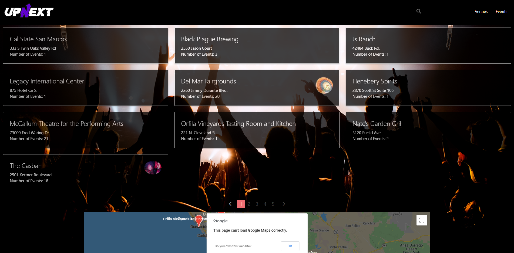

# Up Next

  

An app to locate local shows

Deployment: [Up Next](https://ducktrshessami.github.io/up-next/)

# User story

```
AS A music enthusiast
I WANT to locate smaller up-and-coming performers
SO THAT I can discover new music
```

# Acceptance criteria

```
GIVEN I am searching for an event
WHEN I enter my location
THEN I am presented with a map of venues in my area
WHEN I view a venue from the map
THEN I am presented with the venue name, cover charge, business hours, address, and other information
WHEN I select a venue
THEN I am presented with a list of shows taking place at the venue
WHEN I view a show
THEN I am presented with the show's details
WHEN I select a show
THEN I am redirected to purchase tickets for the show
```

# Screenshots

<details>

<summary>Expand/Collapse</summary>





</details>

---

## Credits
Thank you for all your help and Support!
<br>
[Robert Ortiz](https://github.com/RobOrtiz)
<br>
[Nick Penaloza](https://github.com/ndpenaloza)
<br>
[Emily Thomas](https://github.com/ethomas22)
<br>
[Josh Wee](https://github.com/ducktrshessami)
<br>
## License
[MIT License](https://opensource.org/licenses/MIT)


Powered by [Songkick](https://www.songkick.com/developer/), [Google Maps](https://developers.google.com/maps/), 
[Moment.js](https://www.momentjs.com),
and [Zippopotam.us](http://www.zippopotam.us/)
